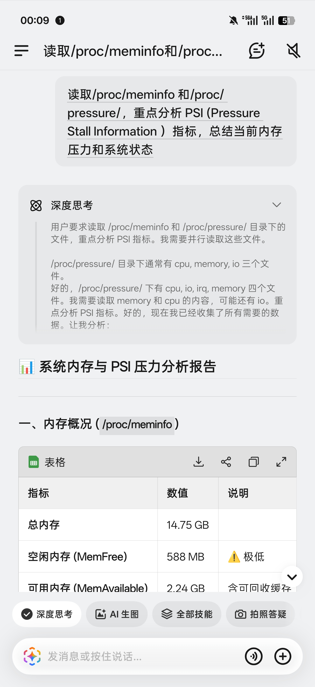
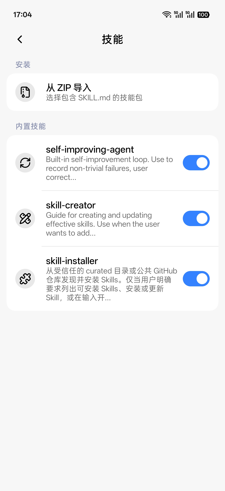

# Eta

[简体中文](README.md) | **English**

    

**A third-party, system-level AI assistant for Android**

Eta is an AI agent designed for phones and other mobile devices. It pairs the autonomous task planning and execution familiar from coding agents such as [Codex](https://openai.com/codex/) with the GUI-driven, cross-app interaction demonstrated by [Doubao Phone Assistant](https://o.doubao.com/). It can work with files, run commands, and write code. Integrations with Android and OEM apps also let it call system APIs directly and retrieve information from notifications, calendars, photos, and other local sources.

**System-level capabilities:**

- **System actions:** call Android APIs directly to set alarms, control media playback, adjust volume, and more.
- **OEM data:** query sources such as Xiaobu Memory, notes, and recording summaries on supported systems with the required permissions.
- **System entry points:** use Xposed hooks to route the power button and requests from Breeno (Xiaobu) or Super XiaoAI to Eta.

Eta has its own agent runtime. An agent loop coordinates model requests, tool execution, and feedback, with Skills and MCP available for extensions. **You must supply your own model-provider API key (BYOK)** to use its AI features; you choose the model and provider.

Requires **Android 14 or later**. The app works across phone brands, and core features do not require root. Root and LSPosed extend system access and assistant integration where permissions and ROM compatibility allow.

[Download APK](https://github.com/Mangi-11/Eta/releases) · [Getting started](#getting-started) · [Why I built Eta](#why-i-built-eta)

## See it in action

| GUI Agent | Breeno with your own model |
| :---: | :---: |
|  |  |

More screenshots: chat, system tools, and settings

| Chat | Commands through Breeno | Direct system API calls |
| :---: | :---: | :---: |
|  |  |  |

| Settings | Tools | Skills |
| :---: | :---: | :---: |
|  |  |  |

## Core capabilities

### Execution tools

- **Direct system API calls:** use Android APIs and system intents to set alarms, control media, adjust volume, and read device status without navigating through app screens.
- **GUI Agent:** combine the accessibility UI tree, element targeting, and screenshots taken as needed to tap, scroll, and type. An overlay shows execution status, and you can stop or take over.
- **Built-in browser:** load JavaScript pages in a WebView, extract readable content, interact with the DOM, and capture screenshots. You can open the same browser session to take control.
- **Terminal and files:** use Android `user`/`root` shells, Alpine or Debian Linux, file operations, and scripts, with support for persistent sessions, asynchronous commands, and daemon tasks.

A task can combine these tools: read web sources and then organize files with a script, or find order details in notifications and open the relevant app to check their status.

### Context and extensions

- **Personal context:** retrieve notifications, app usage, and location on demand. Dedicated searches for photos, calendar events, SMS messages, recordings, health summaries, and chat images require root; some sources also depend on the ROM and installed apps.
- **Long-term memory:** store context for future conversations in a local `MEMORY.md`. Core memory is included within a context budget, with the rest retrieved as needed. You can edit, clear, or disable it.
- **Skills:** load task instructions, reference material, and script resources as needed. Install from public GitHub repositories or import a local ZIP. Installation does not run scripts or grant additional permissions.
- **MCP:** connect remote tools over Streamable HTTP, with optional bearer-token authentication. Enable tools individually to use them alongside local tools.

### Agent runtime

The runtime runs inside Eta. Requests from chat and system assistants use the same agent loop: the model selects tools through tool calling, execution results return to its context, and it decides what to do next. Calls are validated against JSON Schema and permissions are checked before execution. Hooked processes only handle the entry point and return path.

The runtime also manages streaming events, steering, cancellation, and incremental transcripts. Steering messages enter after the current turn completes. Conversations and results are stored locally; after an interruption, Eta attempts to recover existing records without automatically replaying actions. See [Agent Runtime](docs/AGENT_RUNTIME.md) for implementation details.

## A terminal designed for mobile

You can use Eta's terminal yourself or let the agent use it. Each session retains its working directory and environment. The compact view groups input and output by command; the PTY console supports TUIs, keyboard shortcuts, and ANSI rendering. Asynchronous commands and daemon tasks have logs and explicit stop controls.

- **Linux environments:** choose Alpine or Debian. PRoot works without root; rooted devices can also use chroot. The backends have separate installations, with no automatic data migration. PRoot's simulated root identity does not grant Android system privileges.
- **Development tools:** install Python, Node.js, SSH, APK analysis tools, and Kimi Code as needed.
- **File management:** import and export files through the private workspace, share accessible Android directories under `/workspace/mounts/` in Linux, and browse Linux files from the app.

Eta itself can read projects, edit code, run commands, and verify results. For longer coding sessions on a phone, [Kimi Code](https://github.com/MoonshotAI/kimi-code)'s **Kimi Web** offers a web UI well suited to mobile. Continue a conversation, inspect code changes, and review execution results in your browser, with a full coding-agent workflow for vibe coding wherever you are.

After installing Linux, Node.js, and Kimi Code in Eta, launch Kimi Web from the home screen or run `kimi` in the terminal. Kimi has its own model configuration and sessions, so it requires a separate sign-in or setup. You can return to a running instance after leaving the page, or stop it from Eta.

## Models and BYOK

Eta's AI features require **your own model-provider API key**. Built-in provider configurations include OpenAI, Anthropic, Alibaba Cloud Model Studio, DeepSeek, Kimi, MiMo, MiniMax, StepFun, SiliconFlow, and OpenRouter. You can also add custom services.

The provider layer supports OpenAI-compatible Chat Completions, the Responses API, and Anthropic Messages, including SSE streaming, tool calling, image input, and reasoning content. Configure custom endpoints, headers, and request bodies; fetch model lists or add models manually; and override context windows and reasoning effort. Available features depend on the model and API. Some Responses providers also support server-side web search.

## System assistant entry points

- **Power-button long press:** choose the default OEM assistant, Gemini, or Eta.
- **Eta system assistant:** open Eta's text conversation panel from the power button, with screen context and follow-up conversations.
- **Breeno / Super XiaoAI integration:** keep the familiar OEM assistant entry point while routing requests to Eta and your configured model.

Power-button interception requires LSPosed and a supported system.

## Unlocking Gemini and Circle to Search

- **Gemini:** enable system-assistant capabilities, including making the Google app a system app, voice input on the lock screen and while the screen is on, and support for keeping hotword detection working with the screen off.
- **Circle to Search:** enable the feature and trigger it with a long press on the navigation handle or a two-finger long press on the screen.

These features require LSPosed and a supported system. See [Technical Implementation](docs/TECHNICAL.md) for functionality and compatibility details.

## Permissions and data

System tools, sensitive reads, sensitive actions, terminal and file access, browsing, and memory have separate switches, currently enabled by default. The runtime rechecks permissions before execution. Revoked access or a lost connection does not overwrite your saved settings.

- **Model requests:** task-relevant conversation content, images, and tool results are sent to your configured provider. A local runtime does not imply local inference. Custom HTTP endpoints transmit API keys and request content without transport encryption.
- **Local records:** raw arguments and results from sensitive tools and MCP tools are excluded from persistent conversation history; model replies are still saved. Once notification access is granted, Eta retains up to 1,000 notifications for seven days. MCP authentication tokens are stored encrypted.
- **Conversations and backups:** copy or edit messages, delete a conversation from a selected turn onward, and regenerate replies. Import or export conversations, model configurations, and memory. Backups contain API keys.
- **Execution limits:** tasks can be stopped or taken over. Background work remains subject to Android and OEM process management; restart tasks manually after a force-stop or reboot. System and app updates may also require hook adaptations.

## Getting started

1. Download the APK from [Releases](https://github.com/Mangi-11/Eta/releases). After installation, open **Model provider** in Settings, enter your API key, and select a model. Task execution requires tool calling; interpreting images also requires image input support.
2. Enable the tools and permissions you need. GUI control requires Eta's accessibility service. Notification access and usage access are granted separately; location tools require **Allow all the time**. The tools page shows what is available on your device.
3. Start a conversation. For Linux, install a distribution, base tools, and any development tools you need under **Linux tool environment**. For assistant integration, see [System assistant entry points](#system-assistant-entry-points).

- **Unrooted devices:** Android 14+ supports chat, browsing, memory, Skills, MCP, the ordinary terminal, and a private workspace. GUI control and personal data access need their respective permissions. Linux is available on supported 64-bit devices.
- **Rooted devices:** gain access to protected system settings, app management, privileged files, dedicated personal-data searches, root shells, and chroot.
- **LSPosed with a compatible ROM:** adds OEM assistant integration, system shortcuts, and Google feature enablement. Some features also require root.

Dedicated searches for contacts, SMS messages, and calendar events still require root. See [Device Support](docs/ROOTLESS_SUPPORT.md) for full requirements and validation coverage.

## Why I built Eta

### Starting with assistants I did not enjoy using

I started Eta because I found many phone makers' AI assistants frustrating. Answers were often inaccurate, and anything slightly complicated left me finishing the job myself. My first goal was simple: ask about whatever was on my screen. If I came across an unfamiliar idea, I wanted a model to use that context to search and explain it, without copying text, switching apps, and describing everything again.

That experience depends heavily on the model. Models improve quickly, and I want a phone assistant to keep up. Choosing your own model is therefore a basic part of Eta: keep the system entry point you know, and use the model you prefer for both conversation and action.

### Desktop agents thrive; phone AI keeps hitting walls

Desktop systems offer a full shell environment, mature command-line tools, and a broadly accessible file system. Within the user's permissions, a model can read and write files, install dependencies, run programs, and combine existing tools into new workflows. That room to work is a major reason coding agents have flourished on the desktop.

Android has a shell too, but an ordinary app has much less access to directories, system capabilities, and execution environments. Adding a Linux userspace supplies commands and dependencies; it does not connect the agent to the apps and data elsewhere on the phone. Many services remain locked inside their own apps without an interface an agent can call, and even system assistants struggle to connect them.

This is what frustrates me most about phone AI. After years of model improvements, desktop workflows are changing, while much of the phone experience still consists of chat, summaries, and a few predefined scenarios. Feature lists keep growing, but few products change how I use the device. As soon as a task crosses apps or services, I am often left to finish it myself.

Doubao Phone Assistant showed a different possibility. Built around the Doubao app in partnership with phone manufacturers at the OS level, it interprets screens and performs tasks across apps. It also quickly ran into ecosystem boundaries. In December 2025, some users encountered unexpected WeChat logouts and login restrictions, after which Doubao disabled WeChat automation. Users also reported human-verification challenges in Taobao and banking apps asking them to turn off screen sharing. WeChat said its existing security checks might have been triggered.

That month, Doubao also announced restrictions on reward farming, financial apps, and some gaming scenarios. To me, these events show how little system privileges alone can do to open an app ecosystem. Apps keep accounts, data, services, and transactions within their own platforms; phone makers have their own device and service ecosystems to protect. Agents change who owns the user entry point and directs users to services. Opening interfaces involves technical, security, and commercial decisions.

I understand the constraints phone makers face in their partnerships and ecosystems. They still owe users a useful assistant. Even when cross-app actions are limited, they should at least offer a model that understands requests and answers reliably, or let users connect one of their own.

### Installing an agent on a phone is only the beginning

Put OpenClaw or a desktop coding agent in a phone's Linux environment, and it can keep working with files and scripts. Without access to Android's system capabilities and personal context, OpenClaw's lobster is still trapped in a sandbox. The apps, data, and system entry points on the phone still need to be connected.

I am both an independent developer and an Android tinkerer. I have no preinstallation deals or proprietary ecosystem to protect, so I am willing to take a more aggressive approach to system integration and make more of the phone's existing capabilities available to a model the user chooses.

That is where Eta does the integration work: Xposed hooks for Breeno, Super XiaoAI, and the power button; direct Android API calls; and dedicated access to sources such as Xiaobu Memory, notes, and recording summaries. Shell and Linux provide the computing environment, while GUI control covers apps without callable interfaces. A shared agent runtime connects these pieces, giving the model both context about the phone and tools to act on it.

I do not want AI to do everything. If a few taps are faster than waiting for a model, paying for calls, and watching for mistakes, I would rather tap it myself. I want an agent for tasks that benefit from local context, involve repetitive work across apps, or are inconvenient to do by hand. A useful phone agent needs thoughtful integration with the system, local data, and mobile interaction. A long feature list does not tell me whether a product is good to use.

### My view of AI phones and Agentic OS

> This is a longer-term vision. Some of these capabilities are not implemented in Eta.

GUIs are designed for people. Menus turn a loosely expressed need into a specific action, one step at a time. APIs, CLIs, and MCP give models a more direct interface, reducing the overhead and errors associated with screenshots, element recognition, and changing page layouts. GUI agents fill the gaps where those interfaces are missing.

In the Agentic OS I want to see, the operating system becomes the first place a user expresses a goal. It understands that goal in context, then uses an agent runtime to select models, call tools, and check results. The OS can organize the steps that users currently have to piece together across apps and menus.

Apps still supply specialized features and services, but those capabilities also become resources an agent can invoke. A single task could combine several apps, with results presented by the system and individual interfaces available for inspection or manual control. That shifts control over entry points and service discovery, so it requires participation from the app ecosystem.

Personal context, memory, and task state should follow the user across devices. Plan a trip on your phone, get into the car, and have its navigation continue with the same destination and context. Phones, computers, cars, and glasses could share one personal agent's memory while contributing their own sensing and execution capabilities. Voice, vision, and physical actions would let devices respond at the right moment and extend the agent's reach into the physical world.

Eta starts with the models, context, and tools available on Android today. A fully realized Agentic OS on real phones will take coordinated work from phone makers, Android app developers, model providers, and the hardware ecosystem. The technology needs to mature, interfaces need to open, and commercial interests need to align. That complete picture still feels a long way off.

## Further reading

These implementation notes are currently in Chinese:

- [Device support and permissions](docs/ROOTLESS_SUPPORT.md): unrooted and rooted devices, the file workspace, and background execution.
- [Technical implementation](docs/TECHNICAL.md): system tools, data retrieval, browser, terminal, and system integration.
- [Agent Runtime](docs/AGENT_RUNTIME.md): the agent loop, providers, steering, transcripts, and result recovery.
- [HyperOS system entry points](docs/HYPEROS_SYSTEM_ENTRY.md): power-button and Circle to Search integration, requirements, and validation coverage.
- [Native terminal components](docs/TERMINAL_NATIVE.md): PTY and PRoot components, and rebuilding the bundled source.

## References and acknowledgements

- [Pi Coding Agent](https://github.com/earendil-works/pi): the main reference for Eta's agent runtime, including the agent loop, tool calling, steering, and transcript state management.
- [OmniBot](https://github.com/omnimind-ai/OmniBot): a reference project for AI agents on Android.
- [libxposed API](https://github.com/libxposed/api): the modern Xposed API.
- [Miuix](https://github.com/compose-miuix-ui/miuix): the UI component library.

## License

Eta uses the [PolyForm Noncommercial License 1.0.0](LICENSE); personal redistribution, sales, paid installation, and other commercial use require prior written permission from the [author](https://github.com/Mangi-11).

Community: <a href="https://linux.do">LINUX DO</a>
